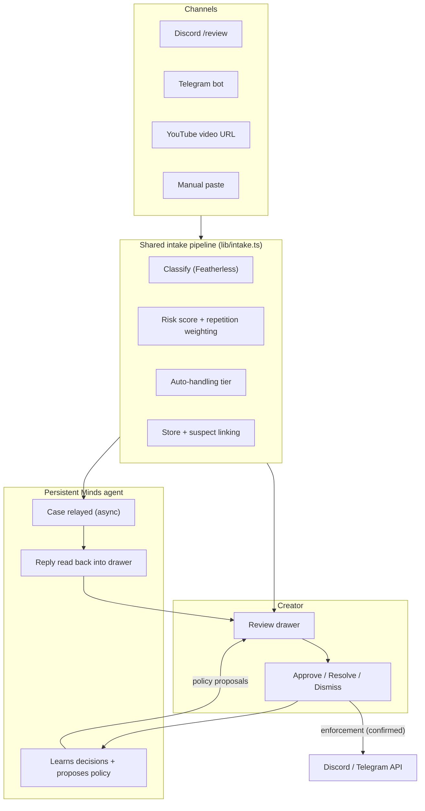
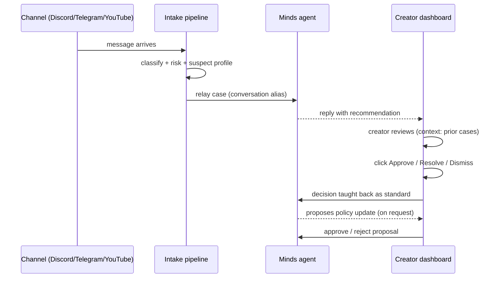

<div align="center">


# CreaGuard

**Creator Safety That Remembers Context — Not Just Rules.**

A persistent AI agent that protects solo creators and small communities across
Discord, Telegram, and YouTube from threats, doxxing, impersonation, scams,
and repeated harassment.

<br/>

[](https://creaguard.sithunyein.com)
[](https://hellominds.ai)
[](https://clerk.com)
[](LICENSE)

<br/>

**🛡️ Threat** · **🚫 Doxxing** · **👤 Impersonation** · **💰 Scam** · **🔁 Harassment**

</div>

---

## The problem

Creators live where their community talks to them — Discord, Telegram,
YouTube. Generic moderation catches spam and bad words, but it misses:

- **Context** — "I know where you live" is a threat, not criticism.
- **Repeat offenders** — the same person harassing you on Discord *and*
  YouTube is one person, not two random messages.
- **Your boundaries** — what *you* consider a ban vs. a joke.

Every serious creator manually triages this. A solo creator on 3 platforms
checks 3 inboxes, each with its own moderation tools, and starts every
decision from zero. Moderation that used to take a team now takes one
overworked creator.

## Who it's for

- **Solo YouTubers, streamers, and artists** whose comments fill with scams,
  doxxing attempts, and repeat trolls.
- **Small community owners** (Discord servers, Telegram groups) who need
  triage, not a full-time moderator.
- **Anyone who wants protection that learns their standards** instead of a
  static keyword filter.

## What it does

| Capability | How |
| --- | --- |
| **One inbox, three platforms** | Discord `/review`, Telegram bot messages, and YouTube comment imports flow into a single safety workspace. |
| **Real classification** | Every message is analyzed (Featherless, strict JSON) into category, severity, confidence, and a recommendation — or an honest `not configured` state, never a fabricated result. |
| **Memory, not keywords** | A persistent **Mind agent** (Minds by Animoca Brands) sees every case in a running conversation, remembers your decisions, and connects behavior across days — and across platforms. |
| **Cross-platform suspect profiles** | Normalized author handles link incidents into one offender profile (entity memory): a repeat offender moving from Discord to YouTube is flagged and scores higher risk. |
| **Proposed actions** | The Mind drafts the call — *ban / timeout / delete* — shown as **Approve: ban user** in the drawer. One click executes it. |
| **Human-in-the-loop enforcement** | Bans, timeouts, and message removal on Discord and Telegram require an explicit confirm-click. Never automatic. YouTube has no moderation API, so CreaGuard honestly recommends the manual action. |
| **Auto-quarantine tier** | Obvious high-confidence scams are hidden from the queue automatically — still reviewable, never deleted. |
| **Decision feedback loop** | Resolve or dismiss with a note and the Mind learns your standard for similar cases. Less human input over time. |
| **Policy evolution** | The Mind proposes policy updates from your decisions; you approve or reject. It never edits policy on its own. |
| **Morning digest** | A daily Telegram summary: new cases, repeat offenders, and what's waiting on you. |
| **Private workspaces** | Sign in (Clerk) and each creator gets an isolated workspace. |
| **Guided onboarding** | After sign-in, a wizard opens the real channel app for you; the moment you message your bot, CreaGuard detects the connection live. Dashboard shows nothing until a channel is connected — by design. |

## How it works



### The Mind's memory loop



## Repository structure

```text
creaguard/
├── app/
│   ├── page.tsx                # Landing page
│   ├── landing.tsx             # Hero, orbit visual, platform ticker
│   ├── faq/page.tsx            # How-it-works FAQ
│   ├── app/page.tsx            # Dashboard (client)
│   ├── creaguard-app.tsx       # Dashboard: overview, incidents, policy, settings
│   ├── globals.css             # Design system (dark theme, tokens)
│   ├── icons.tsx               # Icon set + platform brand marks
│   ├── layout.tsx              # Gated ClerkProvider
│   └── api/
│       ├── health/             # Connection status
│       ├── incidents/          # List / create cases
│       ├── incidents/[id]/     # Get, update, relay, enforce, teach Mind
│       ├── policy/             # Read / save policy
│       ├── policy/proposals/   # Mind-drafted policy proposals
│       ├── connections/        # Per-user channel connections (auto-detect)
│       ├── connect/links/      # Deep links: bot chat, Discord invite, YouTube
│       ├── telegram/           # Bot webhook intake
│       ├── discord/interactions/  # Verified /review slash command
│       ├── youtube/            # Comment import (deduplicated)
│       ├── followups/          # Scheduled autonomous follow-up (cron)
│       └── digest/             # Morning digest to Telegram (cron)
├── lib/
│   ├── intake.ts               # Shared pipeline for every channel
│   ├── analyze.ts              # Featherless classification (strict JSON)
│   ├── risk.ts                 # Deterministic scoring + auto-handling tiers
│   ├── minds.ts                # Minds relay, reply, decision feedback, proposals
│   ├── suspects.ts             # Cross-platform offender profiles
│   ├── enforce.ts              # Discord/Telegram ban, timeout, delete
│   ├── channels.ts             # Telegram decision post-back + digest
│   ├── store.ts                # Redis / file / memory store, workspace-scoped
│   ├── verdict.ts              # Shared channel reply text
│   ├── workspace.ts            # Clerk + env workspace resolution
│   └── types.ts                # Domain types
├── scripts/
│   └── setup-telegram.mjs      # Point the bot webhook at the app
├── middleware.ts               # Clerk auth proxy
├── vercel.json                 # Cron schedules (followups, digest)
├── public/logo.png
├── LICENSE                     # MIT
├── SECURITY.md                 # Vulnerability reporting + safety boundaries
└── .env.example                # Every environment variable documented
```

## Quick start

```bash
npm install
cp .env.example .env.local      # optional — works with zero keys too
npm run dev
```

Open `http://localhost:4173`. Without any environment variables the app runs
with a local file store, manual review mode, and an honest "not configured"
UI — every screen is backed by a live API route.

### Connect real channels

```bash
# Telegram: create a bot with @BotFather, then point it at the deployed app
TELEGRAM_BOT_TOKEN=... TELEGRAM_BOT_SECRET=... \
TELEGRAM_WEBHOOK_URL=https://your-app.vercel.app/api/telegram \
node scripts/setup-telegram.mjs

# Discord: create a bot + /review command in the Developer Portal
#   (invite scopes: bot + applications.commands; permissions: Ban Members,
#    Moderate Members, Manage Messages)

# YouTube: paste a video URL on the Incidents page (YOUTUBE_API_KEY only)
```

## Environment variables

| Variable | Purpose |
| --- | --- |
| `UPSTASH_REDIS_REST_URL` / `UPSTASH_REDIS_REST_TOKEN` | Durable incident and policy storage (Vercel KV names also accepted) |
| `FEATHERLESS_API_KEY` | Real message classification |
| `FEATHERLESS_MODEL` | Optional model override (default `Qwen/Qwen2.5-7B-Instruct`) |
| `MINDS_BUILDER_API_KEY` / `MINDS_MIND_ID` | Relay cases to a persistent Minds agent |
| `NEXT_PUBLIC_CLERK_PUBLISHABLE_KEY` / `CLERK_SECRET_KEY` | Clerk auth (private per-creator workspaces) |
| `WORKSPACE_ID` | Workspace webhooks write into when no one is signed in (default `demo`) |
| `CRON_SECRET` | Bearer secret for the follow-up and digest endpoints |
| `DIGEST_TELEGRAM_CHAT_ID` | Chat that receives the morning digest (falls back to the most recent bot chat) |
| `DISCORD_BOT_TOKEN` / `DISCORD_APPLICATION_ID` / `DISCORD_PUBLIC_KEY` | Discord `/review` intake |
| `TELEGRAM_BOT_TOKEN` / `TELEGRAM_BOT_SECRET` | Telegram bot webhook |
| `YOUTUBE_API_KEY` | YouTube comment import |

## API reference

| Method | Route | Description |
| --- | --- | --- |
| `GET` | `/api/health` | Storage, Featherless, Minds, channel status |
| `GET` / `POST` | `/api/incidents` | List or analyze-and-create cases |
| `GET` / `PATCH` | `/api/incidents/[id]` | Read a case, update status, relay to Minds, enforce, teach a decision |
| `GET` / `PUT` | `/api/policy` | Read or save the safety policy |
| `GET` / `POST` / `PATCH` | `/api/policy/proposals` | List, ask the Mind for, and approve/reject policy proposals |
| `GET` / `PUT` | `/api/connections` | Per-user connected channels with live auto-detection |
| `GET` | `/api/connect/links` | Deep links: bot chat, Discord invite, YouTube |
| `POST` | `/api/telegram` | Telegram bot webhook |
| `POST` | `/api/discord/interactions` | Discord `/review` (Ed25519 signature-verified) |
| `POST` | `/api/youtube` | Import + analyze a video's comments (deduplicated) |
| `POST` | `/api/followups` | Scheduled autonomous follow-up (`CRON_SECRET`) |
| `POST` | `/api/digest` | Morning digest to Telegram (`CRON_SECRET`) |

## Safety boundaries

- Threat, doxxing, impersonation, and scam categories always require human
  review — except obvious scams with ≥90% confidence, which are quarantined
  (hidden, never deleted or acted on).
- Severity 4+ requires human review.
- **Automatic bans, automatic reporting, and evidence deletion are
  hard-blocked in code.**
- The classifier is advisory; it is not an emergency-response service.
- API keys live server-side only; every decision keeps a full audit trail.

See [SECURITY.md](SECURITY.md) for the full policy and how to report
vulnerabilities.

## License

[MIT](LICENSE) © 2026 Sithu Nyein.
